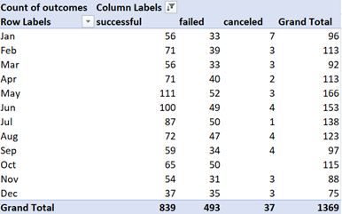
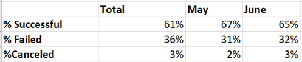
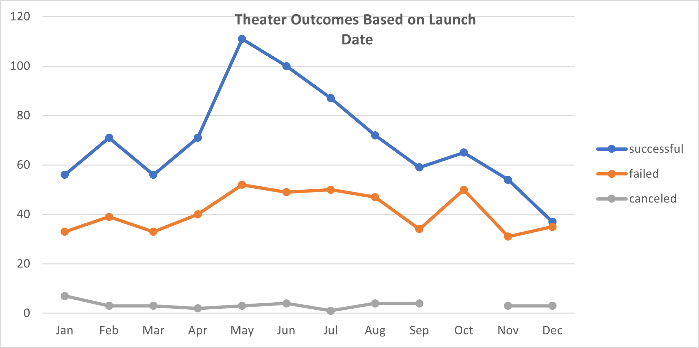
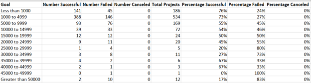
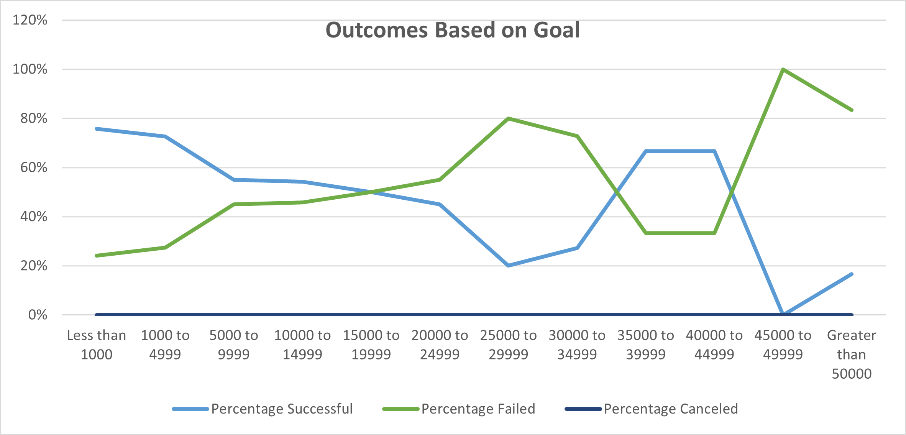

# An Analysis of Campaign Fundraising Performance

## Overview of Project

### Purpose
The purpose of this project was to identify how different campaigns performed relative to their launch dates and funding goals. This was achieved by evaluating data of theater campaigns based on the month in which they were launched and the outcome- successful, failed, or canceled. Data was also analyzed to compare fundraising goals and campaigns outcomes.
## Analysis and Challenges
[Kickstarter Challenge Spreadsheet](Kickstarter_Challenge.xlsx)
### Analysis of Outcomes Based on Launch Date
Table 1: Theater Outcomes by Launch Date
 

 
 
Table 1 shows the number of successful, failed, and canceled theater campaigns by the month in which the campaigns were launched. At first glance, we can see that more campaigns were launched in May than any other month, with a total of 166. May also saw the most successful (111) and failed (52) campaigns.
 
 
Table 2: Percentage of Outcomes by Month
 

 
 
Table 2 displays the percentage of the outcomes based on the total number of campaigns launched, and for launches that took place in May and June. Sixty-seven percent of campaigns launched in May were successful, 31% failed, and 2% were canceled. June was also a popular month for launching campaigns, with 153 total; 65% were successful, 32% failed, and 3% were canceled. The most cancellations happened for those campaigns launched in December. Successful campaigns accounted for 61% of the total campaigns launch during the year; 36% failed and 3% were canceled.
 
 
Figure 1: Theater Outcomes Based on Launch Date
 

 
 
Figure 1 displays the outcomes of theater campaigns based on launch date. The graph shows that there were more successful campaigns in May than any other month. In December, successful and failed campaigns were almost equal. Launch date appears to have had no significant effect on cancellations.
### Analysis of Outcomes Based on Goals
Table 3: Campaign Outcomes based on Fundraising Goals
 

 
 
Table 1 shows campaign outcomes based on their funding goals. Five hundred thirty-four total projects were launched with a goal between $1000 and $4999. Of those, 75% were successful and 24% failed. A total of 694 (67%) campaigns were successful, 349 failed (33%), and none were canceled. 
 
 
Figure 2: Campaign Outcomes based on Goals
 

 
 
The graph in Figure 2 supports Table 3, displaying campaign outcomes based on goals. Although a higher percentage of campaigns were successful with goals less than $1000, and failures appeared to increase in correlation with higher fundraising goals, there were more successful campaigns than failed at goals of $35000 to $39999 and $40000 to $44999, before declining as goals reached $45000. One hundred percent of campaigns failed at a goal of $45000 to $49999.
### Challenges and Difficulties Encountered
Challenges faced when analyzing the data include:
1)	Determining if any measures of central tendencies would be useful to describe the data
- It was determined that this data is categorical. Therefore, there is not a central value because we cannot put categories in actual order. Due to it being categorical data, the mode was the most useful for this data set, since it describes the category with the most values, i.e. the most successful campaigns launched in May.
2)	Nesting formulas in Excel
- While nesting COUNTIFS, excluding any text would result in an error. For example, for “=COUNTIFS(Kickstarter!$D:$D,"<1000",Kickstarter!F:F,"successful",Kickstarter!P:P,"plays"),” leaving out the exclamation point after “Kickstarter” would result in an error message.
- Another example is forgetting to put the greater than (>) symbol before 1000, which would result in the wrong data being formulated.

## Results

- What are two conclusions you can draw about the Outcomes based on Launch Date?
  - It can be concluded that campaigns were more likely to be started during the months of May and June.
  - Campaigns were more likely to be successful in May and June, which may be due to the high number of campaigns launched during that time. 

- What can you conclude about the Outcomes based on Goals?
  - The lower the fundraising goal, the higher chance of a campaign being successful.
- What are some limitations of this dataset?
  -
- What are some other possible tables and/or graphs that we could create?
